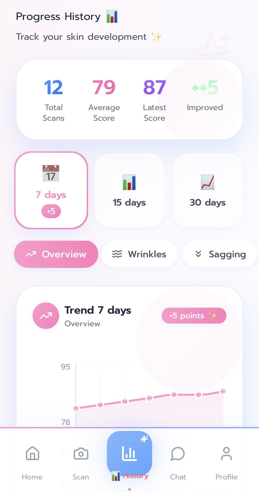
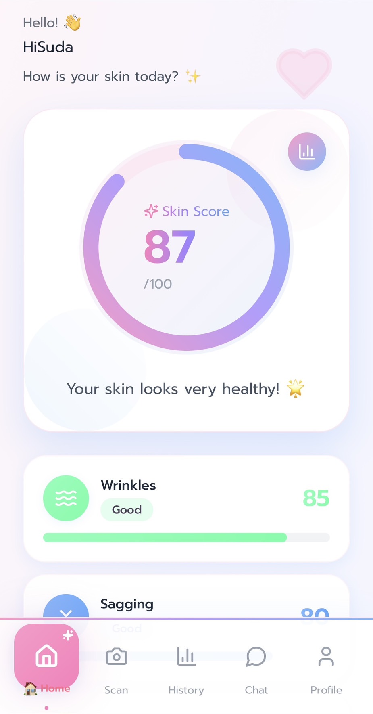

# GlowbieBell – AI Skin Analyzer Backend
<br>

GlowbieBell is a next-generation AI-powered multi-view skin analysis engine, designed specifically for Asian skin tones (Fitzpatrick III–V).  
This backend integrates Computer Vision, ViT transformers, ONNX models, FaceMesh geometry, colorimetric analysis, and GPT-4o Dermatology Intelligence to produce a medically inspired skin health assessment.

It is engineered to power the GlowbieBell consumer skincare platform:  
**Front → Left → Right scan → AI Fusion → Dermatology-grade analysis.**

---

## 📸 System Overview

<table>
  <tr>
    <td></td>
    <td></td>
  </tr>
</table>

---

## 📌 Introduction

GlowbieBell Backend is the core AI engine behind the GlowbieBell skincare platform.  
It processes **3-angle facial images**, performs **skin scoring**, generates **short highlights**, and produces dermatologist-style advice using GPT-4o.

This system is designed with:

- Asian skin tone accuracy  
- Low-light robustness  
- Camera-angle tolerance  
- Realistic beauty-tech scoring  
- Speed optimized for mobile uploads  
- Transfer learning on FFHQ, CelebA, Derm datasets  

GlowbieBell aims to make professional skincare insights accessible to everyone — with zero hardware, using only a smartphone camera.

---

## 🚀 Core Features

### 🔹 Multi-Angle Face Input (Front / Left / Right)

Provides significantly more accurate:

- sagging estimation  
- pigmentation depth  
- wrinkle severity  
- asymmetry detection  
- jawline & cheekbone analysis  

---

### 🔹 7-Dimension Vision AI Engine

Every score is produced by its own specialized pipeline:

| Dimension     | Technology |
|---------------|------------|
| Wrinkles      | ONNX WrinkleNet (FFHQ pretraining) |
| Sagging       | FaceMesh geometric collapse index |
| Pigmentation  | ViT (HuggingFace) melanin estimator |
| Acne          | ViT acne classifier |
| Redness       | Hemoglobin map + ViT redness model |
| Texture       | U-Net pore/roughness segmentation |
| Tone          | LAB Delta-E uniformity analysis |

---

### 🔹 Fusion Model (SkinFusion)

All 7 metrics are combined through:

- dynamic weighting  
- normalization curves  
- Asian-skin baseline adjustments  
- concern-specific score emphasis  

Resulting in:

- **overall_score (0–100)**  
- **dimension_scores**  
- **weighted_contrib**  
- **skin mode**  

---

### 🔹 GPT-4o Dermatology Intelligence

Two specialized outputs:

#### 1) Long Advice (8–12 lines)
- Cleanser / Treatment / Moisturizer / Sunscreen  
- Lifestyle recommendations  
- Sensitivity-aware caution notes  

#### 2) Short Highlights (JSON)
Perfect for result screens:

```json
{
  "highlights_short": ["Skin texture is smooth", "Hydration is good"],
  "improvements_short": ["Slight redness detected", "Uneven tone in cheek area"]
}
```

🧩 System Architecture
User (Frontend)
     |
     | Base64 (front/left/right)
     v
GlowbieBell Backend (FastAPI)
     |
     |-- WrinkleNet (ONNX)
     |-- ViT (pigment / acne / redness)
     |-- U-Net (texture)
     |-- FaceMesh Geometry (sagging)
     |-- LAB DeltaE (tone)
     |
     |--> SkinFusion Model
     |
     |--> GPT-4o (long advice + short summaries)
     |
     v
Final Skin Report JSON


🗂 Repository Structure
Ai_SkinCare_Backend/
│
├── analyzers/
│   ├── acne_vit.py
│   ├── pigmentation_vit.py
│   ├── redness_vit_or_hemo.py
│   ├── sagging_facemesh.py
│   ├── tone_lab.py
│   ├── texture_unet_or_opencv.py
│   └── wrinkles_ffhq.py
│
├── models/                # Local ONNX + ViT weights
├── main.py                # FASTAPI backend
├── skin_fusion_model.py   # Score fusion engine
├── requirements.txt
├── .env.example
└── README.md

⚙️ Installation & Setup
📥 1. Clone Project
git clone https://github.com/Ohm5656/Ai_SkinCare_Backend.git
cd Ai_SkinCare_Backend

🧬 2. Create Virtual Environment
python -m venv .venv
.venv/Scripts/activate          # Windows
source .venv/bin/activate       # Mac/Linux

📦 3. Install Dependencies
pip install -r requirements.txt

🔐 4. Create .env File
cp .env.example .env


Edit .env:

OPENAI_API_KEY=sk-xxxx
REDNESS_MODEL=face-redness-vit

▶️ Running the Backend Locally
uvicorn main:app --host 0.0.0.0 --port 8000 --reload


Open API docs:

http://localhost:8000/docs

http://localhost:8000/redoc

🔥 Main API Endpoint
POST /analyze-face-full
Request Body
{
  "front": "base64 string...",
  "left": "base64 string...",
  "right": "base64 string...",
  "sex": "female",
  "age_range": "25-34",
  "skin_type": "combination",
  "sensitive": true,
  "concerns": "acne,pigmentation"
}

🌐 Deploying to Railway
1️⃣ Connect GitHub Repo
2️⃣ Railway auto-detects Python → builds container
3️⃣ Add Environment Variables
OPENAI_API_KEY=
REDNESS_MODEL=

4️⃣ Deploy → get public URL
5️⃣ Update frontend API URL

Done 🎉

🔭 Future Improvements

YOLO-based facial region segmentation

3D face mesh depth mapping

Real-time skin tracking

Dark Spot progression model

Personalized skincare product matching

👤 Author

Natdanai Lunaha(Ohm)

GlowbieBell – Advanced Skin AI Platform

