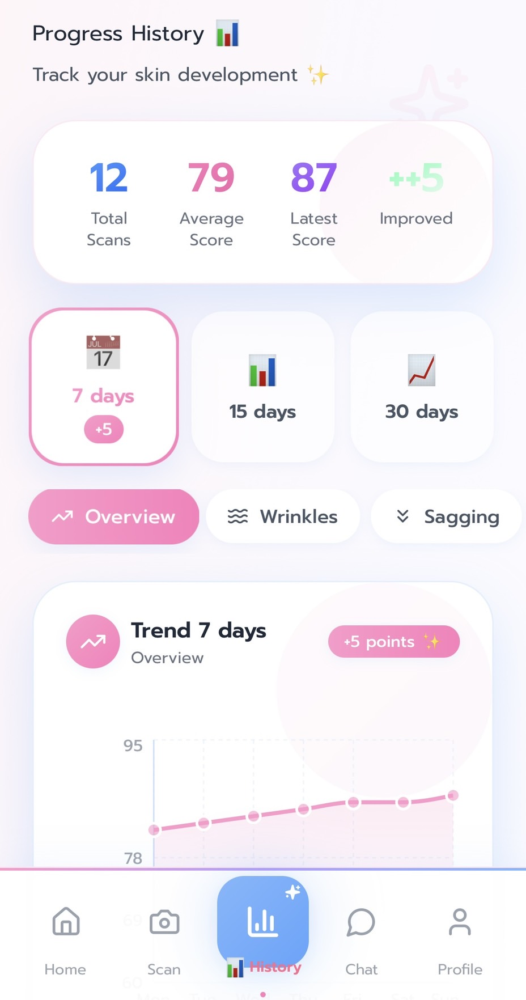
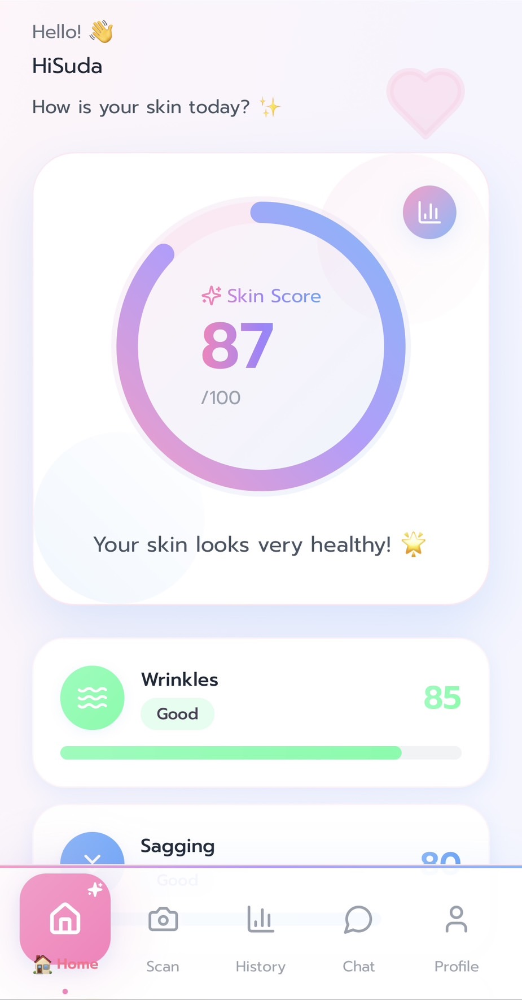

# GlowbieBell – AI Skin Analyzer Frontend
<br>

GlowbieBell is a next-generation AI-powered multi-view skin analysis engine, designed specifically for Asian skin tones (Fitzpatrick III–V).  
This backend integrates Computer Vision, ViT transformers, ONNX models, FaceMesh geometry, colorimetric analysis, and GPT-4o Dermatology Intelligence to produce a medically inspired skin health assessment.

It is engineered to power the GlowbieBell consumer skincare platform:  
**Front → Left → Right scan → AI Fusion → Dermatology-grade analysis.**

---

## 📸 System Overview

<table>
  <tr>
    <td></td>
    <td></td>
  </tr>
</table>

---

## 📌 Introduction

GlowbieBell Backend is the core AI engine behind the GlowbieBell skincare platform.  
It processes **3-angle facial images**, performs **skin scoring**, generates **short highlights**, and produces dermatologist-style advice using GPT-4o.

This system is designed with:

- Asian skin tone accuracy  
- Low-light robustness  
- Camera-angle tolerance  
- Realistic beauty-tech scoring  
- Speed optimized for mobile uploads  
- Transfer learning on FFHQ, CelebA, Derm datasets  

GlowbieBell aims to make professional skincare insights accessible to everyone — with zero hardware, using only a smartphone camera.

---

## 🚀 Core Features

### 🔹 Multi-Angle Face Input (Front / Left / Right)

Provides significantly more accurate:

- sagging estimation  
- pigmentation depth  
- wrinkle severity  
- asymmetry detection  
- jawline & cheekbone analysis  

---

### 🔹 7-Dimension Vision AI Engine

Every score is produced by its own specialized pipeline:

| Dimension     | Technology |
|---------------|------------|
| Wrinkles      | ONNX WrinkleNet (FFHQ pretraining) |
| Sagging       | FaceMesh geometric collapse index |
| Pigmentation  | ViT (HuggingFace) melanin estimator |
| Acne          | ViT acne classifier |
| Redness       | Hemoglobin map + ViT redness model |
| Texture       | U-Net pore/roughness segmentation |
| Tone          | LAB Delta-E uniformity analysis |

---

### 🔹 Fusion Model (SkinFusion)

All 7 metrics are combined through:

- dynamic weighting  
- normalization curves  
- Asian-skin baseline adjustments  
- concern-specific score emphasis  

Resulting in:

- **overall_score (0–100)**  
- **dimension_scores**  
- **weighted_contrib**  
- **skin mode**  

---

###  Installation & Setup
1. Clone Project
```
git clone https://github.com/Ohm5656/Ai_SkinCare_Frontend.git
cd Ai_SkinCare_Frontend
```

2. Create Virtual Environment
```
python -m venv .venv
.venv/Scripts/activate          # Windows
source .venv/bin/activate       # Mac/Linux
```
3. Install Dependencies
```
pip install -r requirements.txt
```
4. Create .env File
```
cp .env.example .env
```


### Running the Frontend Locally
```
npm run dev
```


### Future Improvements

- YOLO-based facial region segmentation
- 3D face mesh depth mapping
- Real-time skin tracking
- Dark Spot progression model
- Personalized skincare product matching

👤 Author
Natdanai Lunaha(Ohm)


